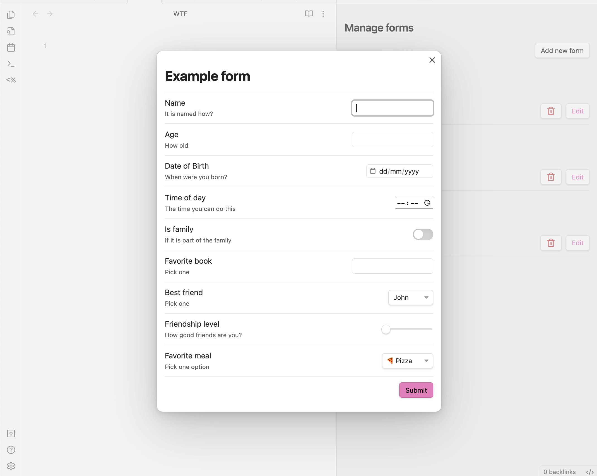
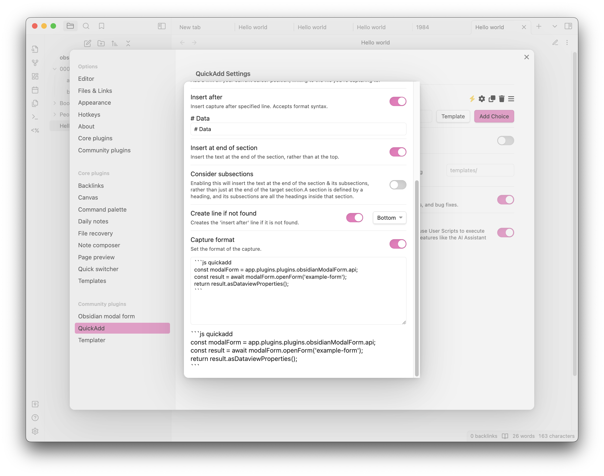

<a href="https://www.buymeacoffee.com/danielo515" target="_blank"></a>

# Obsidian Modal Form Plugin

This plugin for [Obsidian](https://obsidian.md) allows to define forms that can be opened from anywhere you can run JavaScript, so you can combine it with other plugins like [Templater](https://github.com/SilentVoid13/Templater) or [QuickAdd](https://github.com/chhoumann/quickadd).

https://github.com/danielo515/obsidian-modal-form/assets/2270425/542974aa-c58b-4733-89ea-9c20ea11bee9


## Features

- Forms open in a modal window and return you the values, so you can trigger it from:
  - Templater templates
  - QuickAdd captures
  - DataviewJS queries
  - Many other places...
- Define forms using a simple JSON format
- Create and manage a collection of forms, each identified by a unique name
- User interface for creating new forms
- Many input types 
  - number
  - date
  - time
  - slider
  - toggle (true/false)
  - free text
  - text with autocompletion for note names (from a folder or root)
  - text with autocompletion from a dataview query (requires dataview plugin)
  - select from a list 
    - list of fixed values 
    - list of notes from a folder


## Why this plugin?

Obsidian is a great tool for taking notes, but it is also a nice for managing data.
However, when it's time to capture structured data it doesn't offer many conveniences.
Some plugins like [Templater](https://github.com/SilentVoid13/Templater) or [QuickAdd](https://github.com/chhoumann/quickadd) alleviate this problem with templates/automation that ease the creation of notes with a predefined structure, but then you have to fill the data manually. 
The mentioned plugins (templater, quickAdd) have some little convenience inputs, but they have certain tradeoffs/problems: 

- they are limited to input a single value at a time
- they don't have labels, or detailed descriptions about the field you are filling
- you can't skip fields, you will always be prompted for all of them one by one

All of the mentioned tools are great at their job and unleash super convenient workflows.
For that reason, rather than offering an alternative, this plugin is designed as a complement to them, offering some basic building blocks that you can integrate with your existing templates and workflows.

## Friends of modal form
- [Templater](https://github.com/SilentVoid13/Templater) to open modals from templates
- [QuickAdd](https://github.com/chhoumann/quickadd) to quickly capture data from a modal
- [dataview](https://github.com/blacksmithgu/obsidian-dataview) to provide values for autocompletion

## Scope of this plugin

This plugin is intentionally narrow in scope. As it's mentioned in the previous section, it is designed as a building block, so you can integrate it with other plugins and workflows.
The only features that I will consider adding will be ones about improving the form itself.

## Usage

### Call the form from JavaScript

Since the main usage of this plugin is opening forms and getting back their data let's start with that. If you want to lear how to create forms, skip to the next section [define a form](define-a-form).

The plugin exposes an API that can be accessed from any JavaScript code that has access to the global `app` object. So, in order to get the API you can do:

```javascript
const modalForm = app.plugins.plugins.modalforms.api;
````

From here you can call any of the main method of the API, `openForm` which allows you to open a form by name and get back the data. Let's see an example:

```javascript
const modalForm = app.plugins.plugins.modalforms.api;
const result = await modalForm.openForm('example-form');
```

The result is a special type of object that contains the data of the form. 
It also has somme convenience methods to help you process the returned data.
One of them is `asFrontmatterString`, which returns the data as a string that can be used in a frontmatter block. Let's see an example using templater:


#### Usage with Templater

```javascript
---
<%* 
const modalForm = app.plugins.plugins.modalforms.api;
const result = await modalForm.openForm('example-form');
tR += result.asFrontmatterString();
-%>
---
```

When you insert this template in a note, it will open the form, and once you submit it, it will insert the data in the note as a frontmatter block.

#### Usage with QuickAdd

In order to open a form from QuickAdd capture, you need to create a capture and activate the capture format, then in the format text-area you must create a code block with the language defined as `js quickadd` and copy the code below:
```javascript
	```js quickadd
	const modalForm = app.plugins.plugins.modalforms.api;
	const result = await modalForm.openForm('example-form');
	return result.asDataviewProperties();
	``` 
````

Here you have an example screenshot of how it should look like:


### FormResult Methods

The `FormResult` object returned by the `openForm` method has several methods that can be used to process the form data. Here is a brief description of each method:

#### asFrontmatterString()

This method returns the form data as a string that can be used in a frontmatter block. It formats the data in YAML syntax. Here is an example of how to use it:

#### asDataviewProperties()

This method returns the form data as a string of dataview properties. Each key-value pair in the form data is converted into a string in the format `key:: value`. Here is an example of how to use it:

#### getData()

This method returns a copy of the form data. It can be used when you need to manipulate the form data without affecting the original data. 

#### asString(template: string)

This method returns the form data formatted as a string matching the provided template. The template is a string that can contain placeholders in the format `{{key}}`, which will be replaced with the corresponding value from the form data. Here is an example of how to use it in a templater tempmlate:

```
<%* 
const modalForm = app.plugins.plugins.modalforms.api;
const result = await modalForm.openForm('example-form');
tR += result.asString('{{Name}} is {{age}} years old and his/her favorite food is {{favorite_meal}}. Family status: {{is_family}}');
-%>
```


### Define a form

#### Create a new form

Creating a new form is easy, you just need to open the manage forms view, either by clicking in the ribbon icon or by using the command palette (`Obsidian modal form: New form`).
Once there, click on the `+` button and you will be presented with a form to create a named form definition.
The form is self-explanatory, but here is some key points you need to keep in mind:
- The name must be unique, and it will be used to identify the form when you open it from JavaScript, case sensitive
- The title is what you will see as header in the modal window when you open the form
- You will not be able to save the form unless all the fields are valid (which means they have a name and a type)


#### Inline forms

The plugin also supports inline forms, which are forms that are defined when you call the openForm method. This is useful when you want to create a form that is only used in one place and it is simple enough. However, note the format is a bit verbose for typing it manually and it is error prone, so unless it is a very small form, you will most likely prefer to use a named form.

Here is an example of how to use it:

```javascript
const modalForm = app.plugins.plugins.modalforms.api;
const result = await modalForm.openForm({
	title: 'Example form',
	fields: [
		{
			name: 'name',
			label: 'Name',
			description: 'Your name',
			input: { type: 'text'} ,
		},
		{
			name: 'age',
			label: 'Age',
			description: 'Your age',
			input: { type: 'number'} ,
		},
		{
			name: 'favorite_meal',
			label: 'Favorite meal',
			description: 'Your favorite meal',
			input: { type: 'text'} ,
		},
		{
			name: 'is_family',
			label: 'Is family',
			type: 'toggle',
			description: 'Are you family?',
			required: true,
			input: { type: 'toggle'} ,
		},
	],
});
```

You can make it smaller by removing some of the optional fields like description or label, but I really encourage you to define them all.

## Installing the plugin

Until the plugin is accepted in the community plugins list, you will need to install it either manually or through [BRAT](obsidian://show-plugin?id=obsidian42-brat)

### Installing with BRAT
1. Install the [BRAT](obsidian://show-plugin?id=obsidian42-brat) plugin (GitHub page) and enable it.
2. Open command palette and run the command BRAT: Add a beta plugin for testing.
3. Enter `https://github.com/danielo515/obsidian-modal-form` into the modal and press the Add Plugin button.
4. Return to the settings and navigate to Community plugins tab.
5. Enable the plugin.

## Manually installing the plugin

- Copy over `main.js`, `styles.css`, `manifest.json` to your vault `VaultFolder/.obsidian/plugins/modalForm/`.

## How to develop

- Clone this repo.
- Make sure your NodeJS is at least v16 (`node --version`).
- `npm i` or `yarn` to install dependencies.
- `npm run dev` to start compilation in watch mode.

### Releasing new releases

- run `npm version patch`, `npm version minor` or `npm version major` after updating `minAppVersion` manually in `manifest.json`.
- Upload the files `manifest.json`, `main.js`, `styles.css` as binary attachments. Note: The manifest.json file must be in two places, first the root path of your repository and also in the release.
- Publish the release.

> The command `npm version whatever` will bump version in `manifest.json` and `package.json`, and add the entry for the new version to `versions.json`
