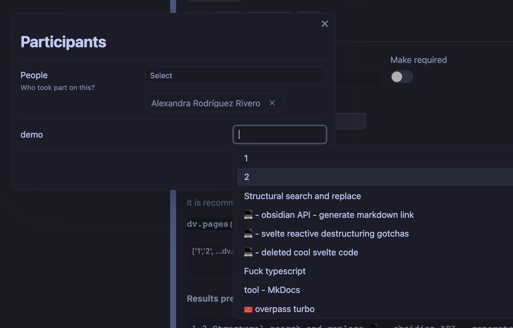

# Advanced usage examples

In this section of the docs you will find some advanced usage examples of modal-form-plugin

## Nesting form calls

## Modifying frontmatter with a form

If you want to modify the content of a notes frontmatter with one of your existing forms, put the following
snippet in a templater template, substituting the name of your form:

```javascript
<%*
  const run = async (frontmatter) => {
    const result = await tp.user.openForm('frontmatter', {
      values: { ...frontmatter },
    });
    return result.getData();
  };
  //first we get the data from the form
  const data = await run(tp.frontmatter);
 // Then we update the frontmatter with the new data
  app.fileManager.processFrontMatter(
    tp.config.target_file,
    frontmatter => {
      Object.assign(frontmatter, data);
    },
  );
%>
```

Please be aware that this is not atomic, so if if something edits the frontmatter while you are editing it within the form,
the form values will not reflect this change and you may be overwriting some changes. Although this is unlikely to happen, it is better to be aware of it.

The values the form understand and that are pressent in the frontmatter, will be populated with the values on the frontmatter.
Then, when you submit the form, the new values will overwrite the old ones, leaving the rest untouched.

## Making calling forms more convenient

If you are using templater, you can make calling forms more convenient by using the following snippet:

```js
const modalForm = app.plugins.plugins.modalforms.api;
module.exports = (formName, options) => modalForm.openForm(formName, options);
```

If you save this snippet as `openForm.js` in your templater snippets folder, then you can then call it like this from templater:

```js
<%*
const result = await tp.user.openForm('example-form', { values: { size: 'large' }});
%>
```

## Exclude subfolders when selecting notes from a folder

Instead of using the `note` type or the `note` source (in case of multi-select) in your form, which doesn't support exclusions yet, we will use `dataview` (either type or as a multi-select source) to get the notes we want.
Then use the following query to exclude subfolders:

```js
dv.pages('"Data" AND -"Data/Nested"').file.name;
```

Here `Data` is the folder we want to get notes from and `Data/Nested` is the subfolder we want to exclude.
Please keep in mind that `dataview` is very sensitive to spaces and quotes. Removing the nested `"` will not work, or adding a space after the `-` will not work either.

## Adding additional items to a Dataview Input

The `dataview` field it is just some expression that gets evaluated, and the values are what are shown in the input form.
It can be a single `dataview` command, or it can be more things, like concatenation of results like this:

```ts
['1','2', ...dv.pages('#programming').title]
```

Which will look like this in the form:




You can take advantage of the preview to experiment a bit with what you will get in the input


